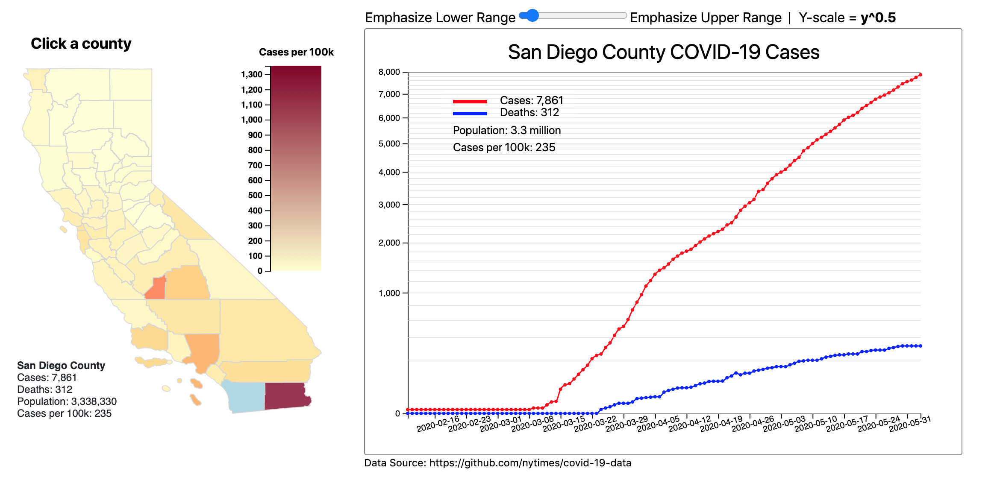

# COVID-19 by County
  

### Summary
Using Python, Flask JavaScript and D3.js, to create a graphical representation of COVID-19 cases in California by county. It uses the flask frame work which downloads currrent data from https://github.com/nytimes/covid-19-data and processes the data using Python's pandas library. A graphical representation is created on the front end with javascript and the D3 library. Topojson was used to create the clickable map.

Live at: https://showdata-flask2.herokuapp.com/

### Key Features
* Hover over a county to show COVID-19 and population stats
* Click on a county to see a chart reprenting cases and deaths over time
* Counties are colored in varying intensity based on cases per capita
* Use the slider to alter the scale exponentially. 
  - This feature emphasizes (exaggerates) the upper or lower range. Because the number deaths tend to appear as a flat line when compared to the number of cases, an exponential scale allows you to zoom in to show more detail. 

### Built with
* Python
* Flask
* Javascript
* D3.js
* topo.json

  

